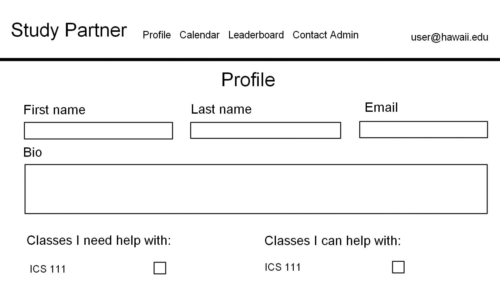

# Study Partner

## Overview

*The problem:* ICS students often spend more time than they need on their homework and don’t learn the material as effectively as they could, because they study alone and do not leverage the power of face-to-face study groups with peer mentors.

*The solution:* Study Partner is an application for UHM ICS students to self-organize face-to-face study groups around a course and/or specific homework or project topic.

## Approach

To use Study Partner, a student must login and set up their profile. The profile enables each student to list courses they have taken and for which they are willing to attempt to provide help (sensei), and courses they are currently taking and for which they might need help (grasshopper). Thus, all students are sensei in some courses and grasshoppers in other courses. Each student must also provide a head shot so that they can be visually identified.

Another section of the site lists all of the ICS courses. Within each course, it is possible to see the grasshoppers and the senseis. A grasshopper can propose a study session around a topic currently being covered in their course (for example, “Write my essay on configuration management”, and a time to meet within ICSpace (i.e. 8:30-9:30pm tonight)). This proposal generates a notification to all of the grasshoppers and senseis, and they can respond by saying they intend to come at some point during the time period.

There is an online calendar that shows all of the study sessions and who is attending.

There are two styles of use for Study Buddy:

You want to plan a group study session for later in the day or some subsequent day. In that case, you schedule the time period for sometime in the future.

You are having a problem right now. In that case, you can go into Study Buddy and schedule the session for “Right Now!”. This indicates you are right now in ICSpace and need help. All the other sensei and grasshoppers for that course will be notified, and hopefully a group will spontaneously form in a few minutes.

Study Partner seems great in theory, but there is a significant barrier to adoption: students are naturally inhibited about asking for or offering help. This might be overcome through the use of well designed game mechanics.

Part of the design of Study Buddy should be some kind of point system, or “levels”, or some other game mechanic to reward students for participating.

In addition, you can solicit gift cards or other kinds of rewards from the ICS Department or UH Manoa to reward the “best” sensei and grasshoppers in a given week, month, or semester. The challenge is to design the point system so that students cannot “game” the system to obtain points without actually helping others. You also want to prevent a “hui” of students from simply pretending to work together to get the most points and then split the prize without actually helping each other.

There must also be admins who monitor the site and who users can contact if they suspect inappropriate behavior.

Important design goals for Study Buddy are:

To encourage use of ICSpace among ICS students
To minimize risk of inappropriate encounters by requiring all meetings to occur in ICSpace.
To encourage face-to-face interaction among ICS students.
There are other mechanisms (Slack, Piazza) for asynchronous, online help and support. Study Buddy is designed to facilitate live, real-world help using ICSpace.

## Mockup page ideas

Some possible mockup pages include:

### Landing page

The landing page is what users see when they first visit the site. 

### Register page

The register page allows new users to sign up for Study Partner. 

### Login page

The login page is used by returning users to log into their accounts. 

### User home page

Users are sent to this page after logging in. It has options for scheduling a future study session or starting a session immediately. It also has options for profile editing, viewing the event calendar, viewing the leaderboard, and sending a message to the admins. 

### Admin home page

Admins are sent to this page after logging in. It has the same options as the user home page with the exception of the "contact admin" option, which is replaced by the "view reports" option. This option allows admins to view messages sent from users. 

### User profile page

New users are sent to this page to set up their profile. This page is also excessible to returning users from the home page. 

### Calendar page

The calendar page shows all currently scheduled study sessions. 

### Create Study Session page

This page allows users to create a study session. That study session will then be added to the calendar page, and all members of the course will be notified. 

### Join Study session page

Clicking on one of the calendar events will bring users to this page. Users are able to sign up for existing study sessions from this page. Users will also be able to see who is currently planning to attend a session. 

### Leaderboard page

The leaderboard page allows users to see which users have accumulated the most points. 

### Contact admin page

This page allows users to contact an admin if they feel others are engaging in inappropriate behavior. 

## Use case ideas

Whether or not the following bullet points list all pages or not, the completed use case should show an end-to-end scenario of using the system.

New user goes to landing page, logs in, gets home page, sets up profile. (How do they learn how system works?)
Admin goes to landing page, logs in, gets home page, edits site.
User goes to landing page, logs in, requests study sesh.
User is notified of study sesh, responds. (Can they respond via text message?)
User checks their status with respect to game mechanics.

## Beyond the basics

After implementing the basic functionality, here are ideas for more advanced features:

Text message interface. See notifications, and reply to confirm attendance all through text message.
Slack integration to facilitate notification and organization of meetings.
A Slack Bot to suggest and help implement Study Buddy meetings.
A rating system for meetings and sensei participation.
