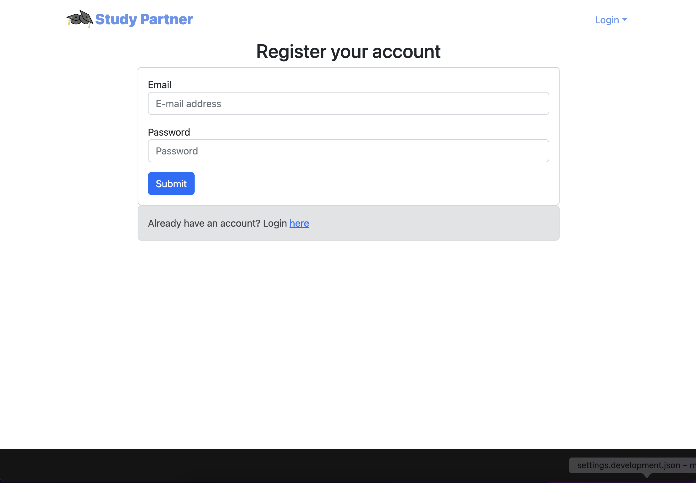
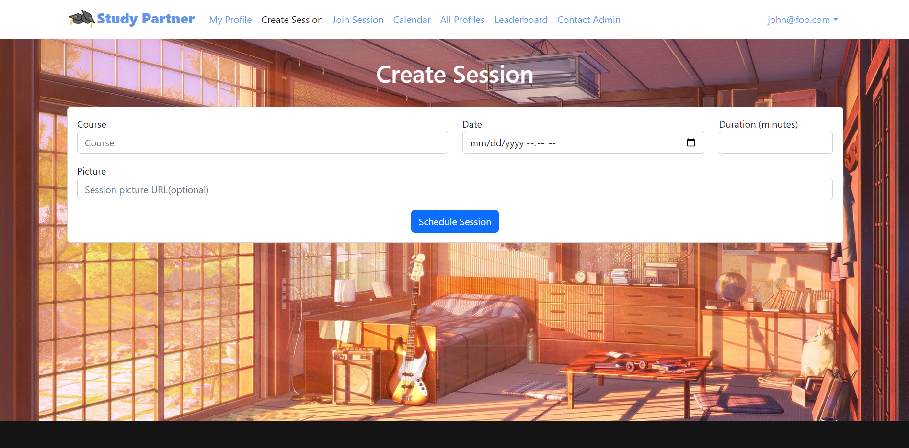
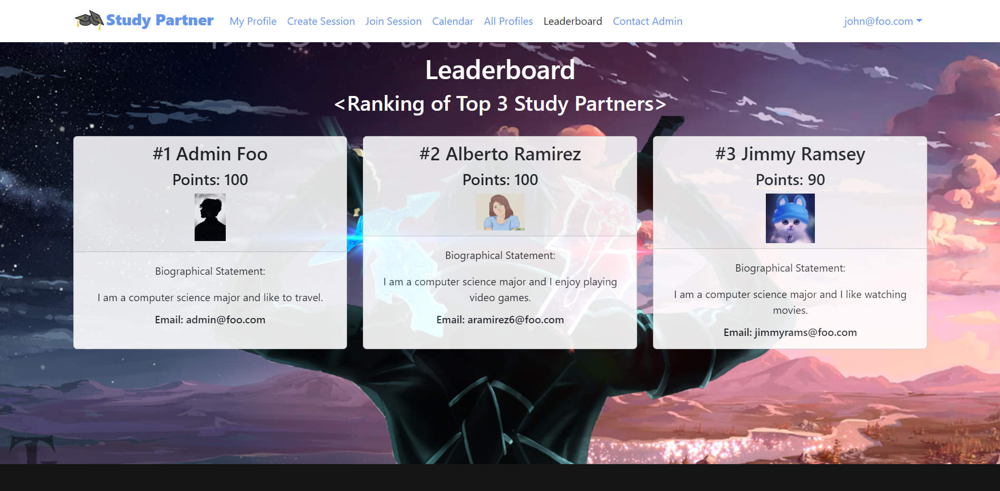

# Study Partner

## Table of contents
* [Study-Partner Code Repositories](https://github.com/study-partner/study-partner)
* [Overview](#overview)
* [User Guide](#user-guide)
* [Developer Guide](#developer-guide)
* [Deployment](#deployment)
* [Development History](#development-history)
* [Community Feedback](#community-feedback)
* [Team](#team-member-introduction)

## Overview

*The problem:* ICS students often spend more time than they need on their homework and don’t learn the material as effectively as they could, because they study alone and do not leverage the power of face-to-face study groups with peer mentors.

*The solution:* Study Partner is an application for UHM ICS students to self-organize face-to-face study groups around a course and/or specific homework or project topic.

### Approach

To use Study Partner, a student must login and set up their profile. The profile enables each student to list courses they have taken and for which they are willing to attempt to provide help (sensei), and courses they are currently taking and for which they might need help (grasshopper). Thus, all students are sensei in some courses and grasshoppers in other courses. Each student can also provide a profile picture. A head shot is recommended so that they can be visually identified.

Another section of the site lists all of the ICS courses. Within each course, it is possible to see the grasshoppers and the senseis. A grasshopper can propose a study session around a topic currently being covered in their course (for example, “Write my essay on configuration management”, and a time to meet within ICSpace (i.e. 8:30-9:30pm tonight)). This proposal generates a notification to all of the grasshoppers and senseis, and they can respond by saying they intend to come at some point during the time period.

There is an online calendar that shows all of the study sessions and who is attending.

There are two styles of use for Study Partner:

1. You want to plan a group study session for later in the day or some subsequent day. In that case, you schedule the time period for sometime in the future.

2. You want to join a study session. In that case, you can take a look at 'Join Session' page to view all the available study sessions.

To encourage participation, Study Partner will feature a point system. Points will be based on the number of events that a student attends. Students will be able to see the top 3 students who currently has the most points on the 'Leaderboard' page. Students are also able to view each others points on the 'All Profiles' page.

There will also be admins who monitor the site. Users can contact these admins if they suspect inappropriate behavior.

Important design goals for Study Partner are:

To encourage use of ICSpace among ICS students
To minimize risk of inappropriate encounters by requiring all meetings to occur in ICSpace.
To encourage face-to-face interaction among ICS students.

## User Guide

This section provides a walkthrough of the Study-Partner user interface and its capabilities.

### Landing page

The landing page is what users see when they first visit the site. 


### Register page

The register page allows new users to sign up for Study Partner. 



### Login page

The login page is used by returning users to log into their accounts. 


### User home page

Users are sent to this page after logging in. It has options for scheduling a study session or joining a study session. It also has options for profile editing, viewing the event calendar, viewing the leaderboard, viewing the profiles for other users, and sending a message to the admins. 


### Admin home page

Admins are sent to this page after logging in. It has the same options as the user home page with the exception of the "contact admin" option, which is replaced by the "view report" option. This option allows admins to view messages sent from users. 


### User Profile page

New users can go to this page to set up their profile. This page is also excessible to returning users who want to make changes to their profile. 


### All Profiles page

Users can see the profiles of all other users on this page. 


### Calendar page

The calendar page shows all currently scheduled study sessions that a user has joined. 


### Create Study Session page

This page allows users to create a study session. That study session will then be available for other users to join. 



### Join Study session page

This page shows all study sessions that are available to join. To join a session, a user hits the "join" button for the session that they want to join.  


### Leaderboard page

The leaderboard page allows users to see which users have accumulated the most points. Points are given to users when they create and join study sessions. 



### Contact admin page

This page allows users to contact an admin if they feel others are engaging in inappropriate behavior. 


### View report page

This page allows an admin to view the reports from users. 


### Use case ideas

New user goes to landing page, sign in, gets home page, sets up profile, go to join session page to schedule study sessions, go to calendar page to see user's own schedule of all sessions joined.

User goes to landing page, logs in, go to join session page to schedule study sessions, go to calendar page to see user's own schedule of all sessions joined.

User can go to all profiles to check who are they meeting with in the session.

User checks the leaderboard for motivation.

Admin goes to landing page, logs in, gets home page, views messages from users.

### Beyond the basics

After implementing the basic functionality, here are ideas for more advanced features:

Text message interface. See notifications, and reply to confirm attendance all through text message.

A rating system for meetings and sensei participation.

## Developer Guide

This section provides information of interest to Meteor developers wishing to use this code base as a basis for their own development tasks.

### Installation

First, [install Meteor](https://www.meteor.com/install).

Second, visit the [Study-Partner application github page](https://github.com/study-partner/study-partner), and click the "Use this template" button to create your own repository initialized with a copy of this application. Alternatively, you can download the sources as a zip file or make a fork of the repo.  However you do it, download a copy of the repo to your local computer.

Third, cd into the study-partner/app directory and install libraries with:

```
$ meteor npm install
```

Fourth, run the system with:

```
$ meteor npm run start
```

If all goes well, the application will appear at [http://localhost:3000](http://localhost:3000).

### Application Design

Study-Partner is based upon [meteor-application-template-react](https://ics-software-engineering.github.io/meteor-application-template-react/), [meteor-example-form-react](https://ics-software-engineering.github.io/meteor-example-form-react/) and [bowfolios](https://bowfolios.github.io/). Please use the videos and documentation at those sites to better acquaint yourself with the basic application design and form processing in Study-Partner.


## Initialization

The [config](https://github.com/study-partner/study-partner/tree/main/config) directory is intended to hold settings files.  The repository contains one file: [config/settings.development.json](https://github.com/study-partner/study-partner/blob/main/config/settings.development.json).

This file contains default definitions for Profiles, Sessions and the relationships between them. 

The settings.development.json file contains a field called "loadAssetsFile". It is set to false, but if you change it to true, then the data in the file app/private/data.json will also be loaded.  The code to do this illustrates how to initialize a system when the initial data exceeds the size limitations for the settings file.


### Quality Assurance

#### ESLint

Study-Partner includes a [.eslintrc](https://github.com/bowfolios/bowfolios/blob/main/app/.eslintrc) file to define the coding style adhered to in this application. You can invoke ESLint from the command line as follows:

```
meteor npm run lint
```

Here is sample output indicating that no ESLint errors were detected:

```
$ meteor npm run lint

> study-partner@ lint /Users/feiyichen/github/study-partner/study-partner/app
> eslint --quiet --ext .jsx --ext .js ./imports ./tests

$
```

ESLint should run without generating any errors.

It's significantly easier to do development with ESLint integrated directly into your IDE (such as IntelliJ).

#### End to End Testing

Study-Partner uses [TestCafe](https://devexpress.github.io/testcafe/) to provide automated end-to-end testing.

The study-partner end-to-end test code employs the page object model design pattern.  In the [study-partner tests/ directory](https://github.com/study-partner/study-partner/tree/main/app/tests), the file [tests.testcafe.js](https://github.com/study-partner/study-partner/blob/main/app/tests/tests.testcafe.js) contains the TestCafe test definitions. The remaining files in the directory contain "page object models" for the various pages in the system (i.e. Home, Landing, Courses, etc.) as well as one component (navbar). This organization makes the test code shorter, easier to understand, and easier to debug.

To run the end-to-end tests in development mode, you must first start up a Study-Partner instance by invoking `meteor npm run start` in one console window.

Then, in another console window, start up the end-to-end tests with:

```
meteor npm run testcafe
```

You will see browser windows appear and disappear as the tests run.  If the tests finish successfully, you should see the following in your second console window:

```
$ meteor npm run testcafe

> study-partner@ testcafe /Users/feiyichen/github/study-partner/study-partner/app
> testcafe chrome tests/*.testcafe.js

 Running tests in:
 - Chrome 86.0.4240.111 / macOS 10.15.7

 study-partner localhost test with default db
 ✓ Test that landing page shows up
 ✓ Test that signin and signout work
 ✓ Test that signup page, then logout works
 ✓ Test that profiles page displays
 ✓ Test that profile page display and profile modification works
 ✓ Test that calendar page works
 ✓ Test that contact admin page works
 ✓ Test that admin view reports works
 ✓ Test that the home page displays
 ✓ Test that leaderboard works
 ✓ Test that join session page displays
 ✓ Test that create session page works


 12 passed (2m 52s)

 $
```

You can also run the testcafe tests in "continuous integration mode".  This mode is appropriate when you want to run the tests using a continuous integration service like Jenkins, Semaphore, CircleCI, etc.  In this case, it is problematic to already have the server running in a separate console, and you cannot have the browser window appear and disappear.

To run the testcafe tests in continuous integration mode, first ensure that study-partner is not running in any console.

Then, invoke `meteor npm run testcafe-ci`.  You will not see any windows appear.  When the tests finish, the console should look like this:

```
$ meteor npm run testcafe-ci

> study-partner@ testcafe-ci /Users/feiyichen/github/study-partner/study-partner/app
> testcafe chrome:headless tests/*.testcafe.js -q --app "meteor npm run start"

 Running tests in:
 - Chrome 86.0.4240.111 / macOS 10.15.7

 study-partner localhost test with default db
 ✓ Test that landing page shows up
 ✓ Test that signin and signout work
 ✓ Test that signup page, then logout works
 ✓ Test that profiles page displays
 ✓ Test that profile page display and profile modification works
 ✓ Test that calendar page works
 ✓ Test that contact admin page works
 ✓ Test that admin view reports works
 ✓ Test that the home page displays
 ✓ Test that leaderboard works
 ✓ Test that join session page displays
 ✓ Test that create session page works


 12 passed (2m 52s)

$
```

All the tests pass, but the first test is marked as "unstable". At the time of writing, TestCafe fails the first time it tries to run a test in this mode, but subsequent attempts run normally. To prevent the test run from failing due to this problem with TestCafe, we enable [testcafe quarantine mode](https://devexpress.github.io/testcafe/documentation/guides/basic-guides/run-tests.html#quarantine-mode).

The only impact of quarantine mode should be that the first test is marked as "unstable".

## From mockup to production

Study-Partner is meant to illustrate the use of Meteor for developing an initial proof-of-concept prototype.  For a production application, several additional security-related changes must be implemented:

* Use of email-based password specification for users, and/or use of an alternative authentication mechanism.
* Use of https so that passwords are sent in encrypted format.
* Removal of the insecure package, and the addition of Meteor Methods to replace client-side DB updates.

## Continuous Integration


Study-Partner uses [GitHub Actions](https://docs.github.com/en/free-pro-team@latest/actions) to automatically run ESLint and TestCafe each time a commit is made to the default branch.  You can see the results of all recent "workflows" at [https://github.com/study-partner/study-partner/actions](https://github.com/study-partner/study-partner/actions).

The workflow definition file is quite simple and is located at
[.github/workflows/ci.yml](https://github.com/study-partner/study-partner/blob/main/.github/workflows/ci.yml).

## Deployment

The Study Partner has been deployed on the Digital Ocean.

Deployed application can be found at [https://study-partner.xyz/](https://study-partner.xyz/).

## Development History

* [Milestone 1](https://github.com/orgs/study-partner/projects/1)
  - Basic Mockup development.
  - Page color adjustment.
  - Deployment.
* [Milestone 2](https://github.com/orgs/study-partner/projects/2)
  - Page Improvement.
  - Database update and creation.
* [Milestone 3](https://github.com/orgs/study-partner/projects/3)
  - Add real data to the system
  - Find at least five UH community members (not from ICS 314) to try out your system and provide feedback.
  - Implement acceptance testing
  
## Community Feedback
Ethan M.
>* What do you like about this website/project?
>>  - I liked that you are able to create your own profile for the site and are able to see what someone needs help with and what people know. I like this idea of >planning study sessions as well, it makes it easier to organize these study sessions. 
>* What is something (eg. features, designs) that you would like this project to have? How can we make this website better?
>>  - I think something I would like this project to have is to maybe have a way for the people to message each other. Ex. a direct message system, so you can >communicate with other people directly as well. 
>* Any other suggestions or comments?
>>  - None. 

Bing Y. 
>* What do you like about this website/project?
>>  - Easy to understand
>* What is something (eg. features, designs) that you would like this project to have? How can we make this website better?
>>  - Change Password, forget password, and find 
>* Any other suggestions or comments?
>>  - Add something more and I like your minimalist style

Meiyi W. 
>* What do you like about this website/project?
>>  - Looks good
>* What is something (eg. features, designs) that you would like this project to have? How can we make this website better?
>>  - Web design can look better.
>* Any other suggestions or comments?
>>  - No 

Addison
>* What do you like about this website/project?
>>  - I like how you can easily join or create a session and even sign up how it takes you around easily
>* What is something (eg. features, designs) that you would like this project to have? How can we make this website better?
>>  - I do not know
>* Any other suggestions or comments?
>>  - No it is great

Haojiang W. 
>* What do you like about this website/project?
>>  - Everything is fantastic. I like that I can create a profile for myself so that I can see what other people know and what they need help with. To keep things >organized, I believe it's a good idea to arrange study sessions in advance. 
>* What is something (eg. features, designs) that you would like this project to have? How can we make this website better?
>>  - For the current stage, the function is usable, I don't think adding additional functions can improve the experience
>* Any other suggestions or comments?
>>  - So far so good

## Team Member Introduction

- [Zian Zeng:](https://zianzenguh.github.io/) I am studying for a B.S. in Computer Science (Data Science Track) in the Department of Information and Computer Sciences at the University of Hawaii. I expect to graduate in Spring, 2024.
- [Jingyi He:](https://jing2003.github.io/) I am studying for a B.S. in Computer Science in the Department of Information and Computer Sciences at the University of Hawaii. I expect to graduate in Spring, 2025.
- [Colby Kagamida:](https://colbykag.github.io/) I am studying for a B.S. in Computer Engineering at the Department of Electrical and Computer Engineering at the University of Hawaii at Manoa. I expect to graduate in Spring 2023.
- [Feiyi Chen:](https://feiyichen01.github.io/) I am studying for a B.S. in Computer Science in the Department of Information and Computer Sciences at the University of Hawaii. I expect to graduate in Spring, 2024.
- [James Grande:](https://grandejames.github.io/) I am studying for a B.S. in Computer Science in the Department of Information and Computer Sciences at the University of Hawaii. I expect to graduate in 2024. 
- [Team Contract](https://docs.google.com/document/d/12LxKhkw1Pm1xC4pM0Jf1obD1x-AB10m1somsgEHzGBM/edit?usp=sharing)
